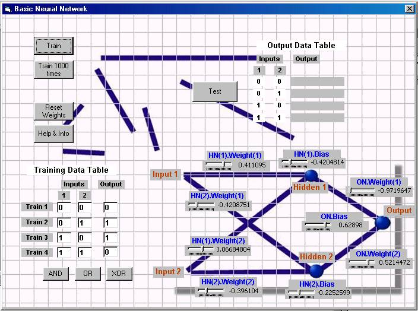



## Basic Neural Net

### Description

This is a Basic Neural Net, based on original code by Richard Gardner. This is designed as a learning program, to help in the process of learning and understanding the basics of coding neurons and neural networks. I've taken Richard's code, changed it around a bit to make the neuron data a bit more readable, and commented the code to explain whats going on at every stage. The program uses backwards propogation (or back prop) to train the network. There is a basic data structure for a neuron that stores all the information about the neuron and associated weights, and the code (Richard's, mainly) is broken down into parts that allow you to clearly see code for training, activation of a neuron, and getting an output from the network. There's a nice GUI stuck on the front of it all, which gives you a graphical representation of how the neurons are layed out in my code (its a static graphic). As it is at the moment, it makes for quite a nice tutorial program if you just want to compile it and watch it train for the preset functions, or enter your own input data and train it for that. Basic neural net knowledge is assumed (you should really know what a neuron is, and have some idea of what training a neural network to do functions like AND or XOR actually means, otherwise the GUI won't mean much from the outset). I'm still really only a neural net learner, so I don't make any guarantee that this is completely accurate or complete in anyway. Hopefully the code is written so that you can expand on it to make different neural configurations if you want to. I don't mind what you do with any of this program, or code, but would be interested to hear comments and/or suggestions.
 
### More Info
 
Doesn't take any file or command line inputs, however you can graphically configure weights, and enter training data.

If you want to know about Neural networks, get some basic information on what a neuron is and the idea behind a neural network first, or at the same time as you read through this code. (also, remember the GUI is just setup for the configuration of neurons in the code as it is, if you change the code, you'll need to turn it off, or update the graphic)

No file or other output except for graphical display of weight values and facility to view possible current outputs of the network.

You *may* know more about neural networks than before you downloaded this program ;-)

             |
---                |---
**Submitted On**   |2001-03-29 18:37:18
**By**             |[obfuscator](https://github.com/Planet-Source-Code/PSCIndex/blob/master/ByAuthor/obfuscator.md)
**Level**          |Intermediate
**User Rating**    |4.7 (84 globes from 18 users)
**Compatibility**  |VB 5\.0, VB 6\.0
**Category**       |[Miscellaneous](https://github.com/Planet-Source-Code/PSCIndex/blob/master/ByCategory/miscellaneous__1-1.md)
**World**          |[Visual Basic](https://github.com/Planet-Source-Code/PSCIndex/blob/master/ByWorld/visual-basic.md)
**Archive File**   |[Basic Neur188784272001\.zip](https://github.com/Planet-Source-Code/obfuscator-basic-neural-net__1-22136/archive/master.zip)

